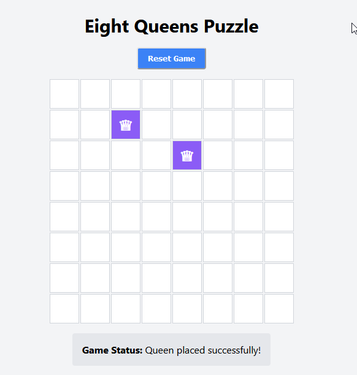

# 8 queens riddle

A playable game of the [8 queens riddle](https://en.wikipedia.org/wiki/Eight_queens_puzzle)

## Deploy Your Own

Deploy your own Create React App project with Vercel.

_Live Example: https://create-react-template.vercel.app/_

## Demo

You can demo the application at [8queesriddle.vercel.app](https://8queesriddle.vercel.app/).

## Available Scripts

In the project directory, you can run:

### `npm start`

Runs the app in the development mode. Open [http://localhost:3000](http://localhost:3000) to view it in your browser.

The page will reload when you make changes. You may also see any lint errors in the console.

### `npm test`

Launches the test runner in the interactive watch mode. See the section about [running tests](https://facebook.github.io/create-react-app/docs/running-tests) for more information.

### `npm run build`

Builds the app for production to the `build` folder.

It correctly bundles React in production mode and optimizes the build for the best performance. The build is minified and the filenames include the hashes.